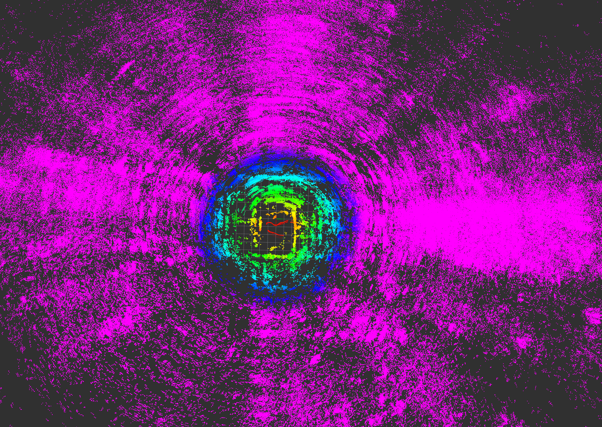
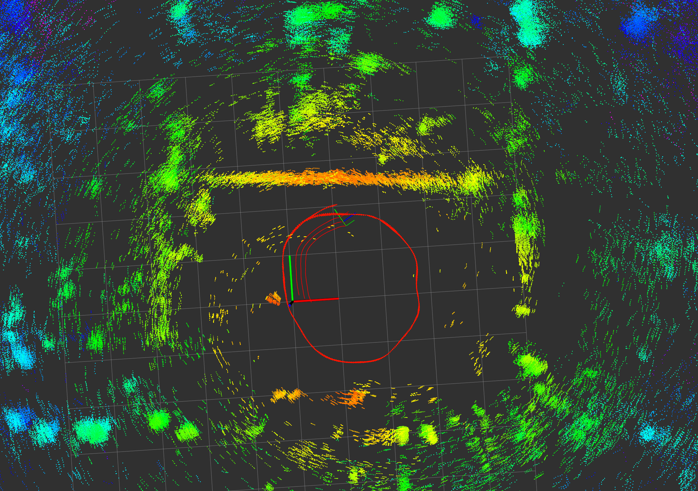
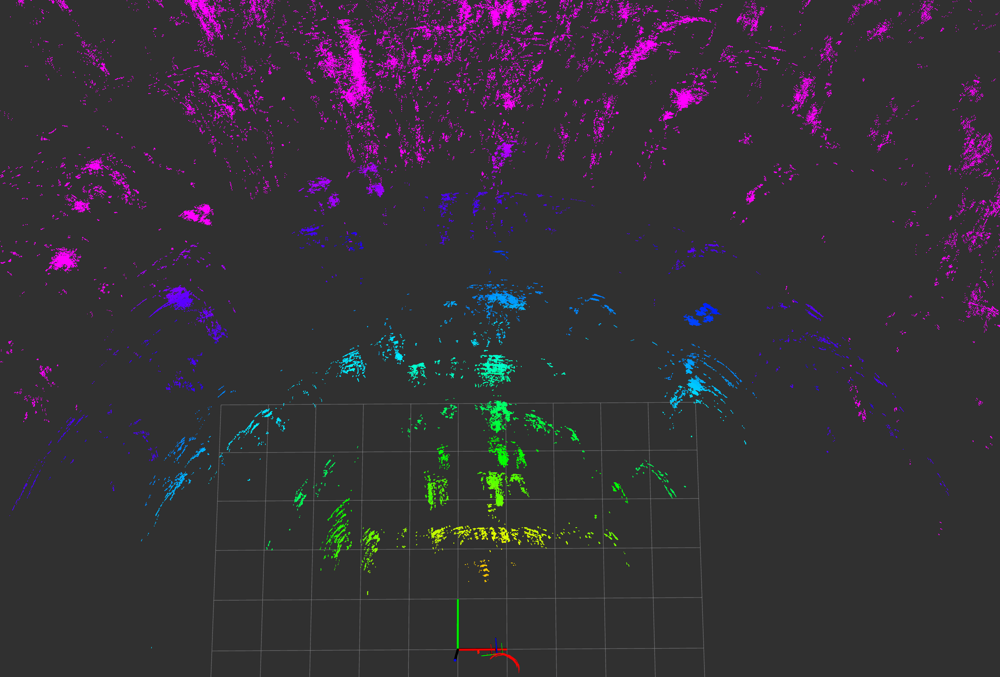
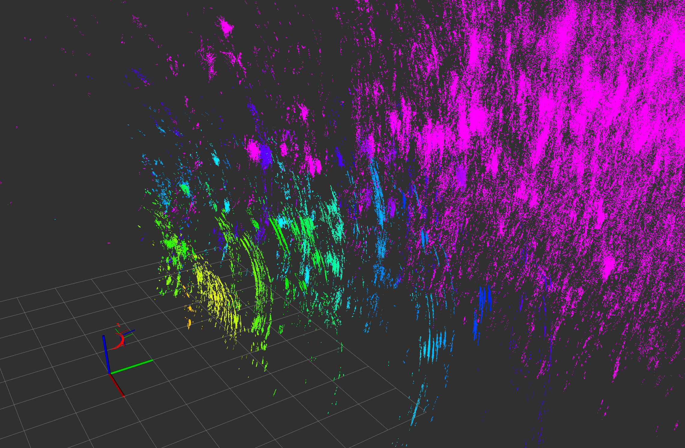

# Goal
Aggregate point cloud of ZadarLabs over time to hopefully see structures of the environment.

# Data
Go to root directory at `/RIOAnalysis/data/AllSensors_noRIO` and look at subdirectories. Following sections should have dataset uniquely noted.
RVIZ file can be found in this directory, however some values might have been adjusted accordingly.

# Results
Coloration is according to 'range' channel.
The large coordinate frame denotes the VICON coordinate frame; e.g. x-axis (red) is parallel to the windows and y-axis (green) points parallel to the hallways.
## allSensors_noRIO_short_circle_2024-04-02-16-53-27.bag and ...-16-56-27.bag
Color denotes distance. Pink at 10m or further. Room is little speck in the middle. Aggregation time of 15s. Large coordinate frame in the center is for the VICON system.

    
    
     
    <em>Top down view of panning motion in VICON room while walking in 'circles'.</em>

In the right  image we can see in red the trace from the circular motion. The straigth edge which is approached closely is most likely the metal-laced-net. It is not obvious that the wall behind is detected.

## allSensors_noRIO_short_staticslowpan_2025-04-02-17-00-38.bag
In the figures we have a part of the dataset which is quasi-static (handheld) and aggregated for 20s.

    
    
     
    <em>Two different perspectives of static motion within the VICON room.</em>

# Conclusion
- Point cloud certainly has some structure
- Unclear whether we can look past the 'net'
- We clearly detect points too far away (pink), hinting at multipath-reflections. How about outdoors (static)?